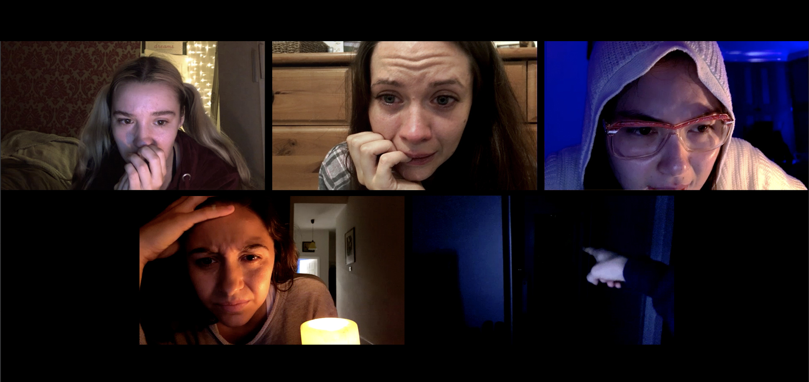
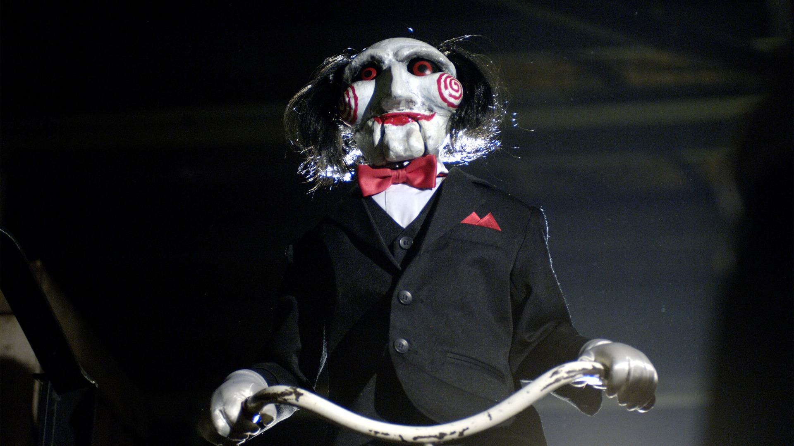
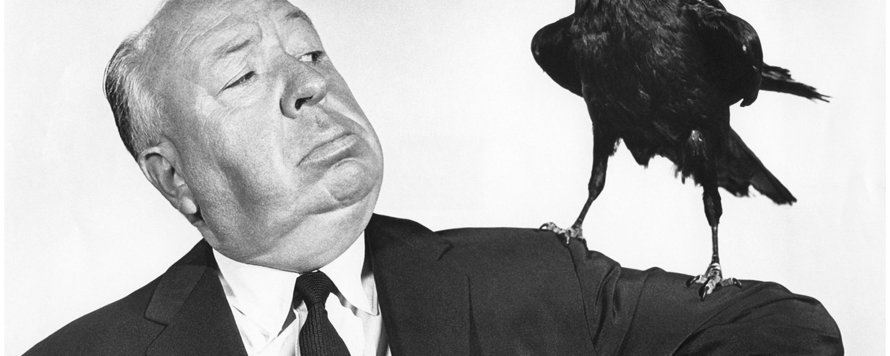

# The 3 best horror movies of all time

The best horror movies keep us on the edge of our seats. They’re unpredictable and terrifying, with no respect whatsoever for our boundaries or bedtimes. The best scary movies are the ones that don’t just make you jump when you are watching them – but clamber under the duvet with you when you retreat to sleep. And yet, still, we want to find the scariest, the most terrifying and the most disturbing horror films to fire digitally into our eyeballs. Even when the world outside is unpredictable we still hunger to settle down with a horror movie or six where we at least can watch destruction in a safe environment.

## Host (2020)

The movie: We knew it was on the way, but post-pandemic horror has already arrived in the shape of a Zoom call gone very, very wrong. Desperately on the hunt for something to do other than endless lockdown quizzes – we feel this – a group of friends get together for an online mid-lockdown seance. What follows is a short, sharp shock of found footage adrenaline in an intimidatingly lean 56 minute run time. Host isn’t the first horror to take place on a computer screen, taking terrifying inspiration from REC, The Blair Witch Project, and Paranormal Activity, yet delivering a dangerously relevant frightmare. Happy spookies. 

## Saw (2004)

The movie: It might have reignited the so-called torture porn genre with its (mostly) truly disgusting sequels but - and this is a huge ‘but’ - the original Saw is nowhere near as gross-gusting as you think it is and happens to be brilliant horror. Yes, the title is about an implement that a depraved killer suggests someone takes their leg off with rather than use a key to unlock a cuff, but Saw is actually remarkably restrained. The ideas at work here are significantly more grisly in your own mind than what you see on screen. Made on a shoestring budget by Leigh Whannell and James Wan, this tale of two men waking up in a bathroom, a corpse between them, is twisted but constantly intriguing. 

## The Birds (1963)

The movie: Sure, there’s all that talk about showers and murder - Editor’s note: we know it’s not just ‘talk’ and Hitchcock’s Psycho is a genuine horror masterpiece - but it’s time to talk about the feathery elephant in the room. The Birds, the Master of Suspense’s loose adaptation of a short story of the same name by Daphne du Maurier, is scare cinema at its finest. When Tippi Hedren’s Melanie Daniels heads to Bodega Bay to deliver some love birds, she gets far more than she bargained for when the wild winged inhabitants of the town decide that human eyes might taste just as good as discarded chips. 

